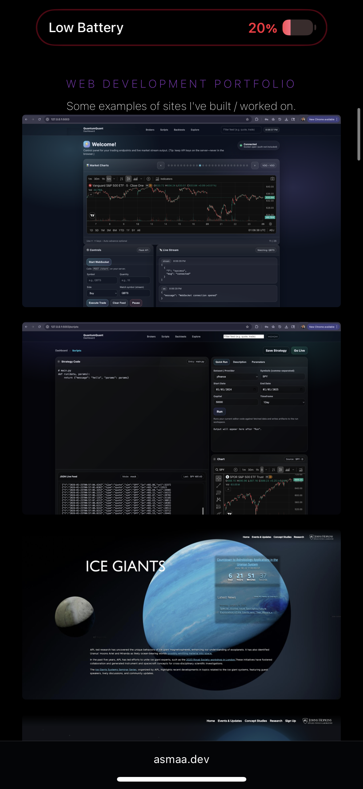
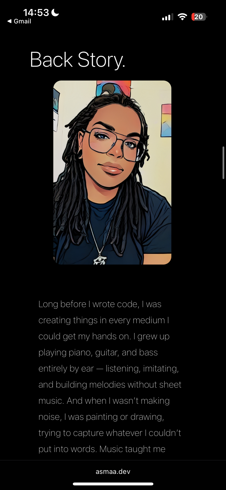
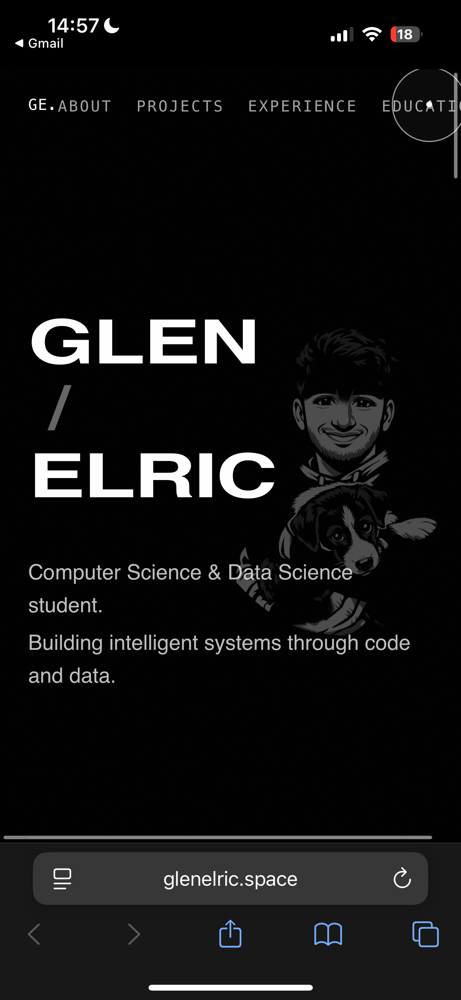
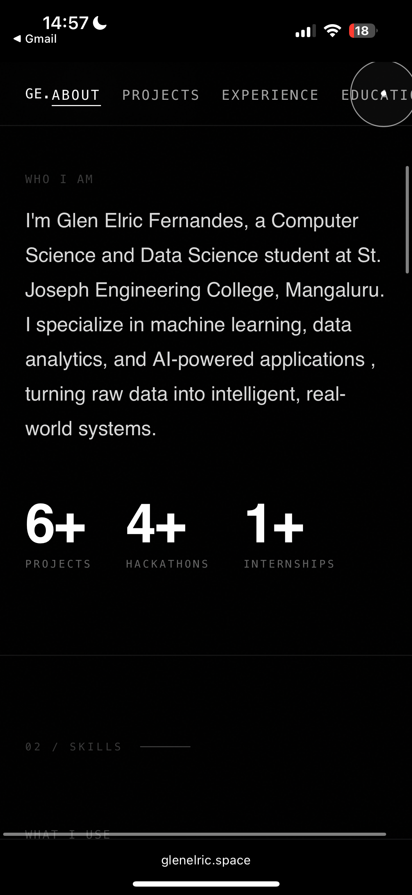

# Project, Milestone 1: Design Journal

[← Table of Contents](journal.md)

> **Replace ALL _TODOs_ with your work.** (There should be no TODOs in the final submission.)
>
> Be clear and concise in your writing. Bullets points are encouraged.
>
> Place all design journal images inside the "design-plan" folder and then link them in Markdown so that they are visible in Markdown Preview.
>
> **Everything, including images, must be visible in _Markdown: Open Preview_.** If it's not visible in the Markdown preview, then we can't grade it. We also can't give you partial credit either. **Please make sure your design journal is easy to read for the grader** (no side-ways images, etc.); in Markdown preview the **question _and_ answer should have a blank line between them**.

## Website Topic
> Briefly explain what your website will be about. Share your vision of your website. (1 sentence)
>
> Example: My website will be about the Grassroots festival in Trumansburg NY.

My website will be a personal portfolio website that I can use when applyign for jobs and masters programs, and will include the following content: Information about my life, past data analytics projects I have completed, professional/club work so far, other extracurriculars I am involved in, and my resume/other links.

## Example Website 1

website url: https://asmaa.dev/index.html

Home screen mobile screenshots:

- Describe the theme of the website and the emotions it evokes.

Answer: The theme of the website is creative and bold. There are pictures of art, pictures of cats, etc. and the text is bold with striking contrast. The meotions it evokes are curiosity and joy.

- Describe the responsiveness and layout for narrow and wide screens.

Answer: This website is quite usable for both wide and narrow screens - the navigation bar turns into a menu, content goes from side-by-side to stacked vertically, etc. One flaw is that some of the content gets way too tiny when you view it on a narrow browser/iphone, but it is all technically working.

- List some common design elements you see on this website that you may want to include in your own website.

Answer: I really like how there's a navigation bar in wide screen mode that converts into a menu in narrow mode as that is very usable. I appreciate the framed content in wide mode as that makes things look organized and easy to see, and its more usable when it goes to narrow mode because it then stacks vertically.

## Example Website 2

https://www.glenelric.space/

- Describe the theme of the website and the emotions it evokes.

Answer: The theme of the website is very technology-centered and very bold/dramatic, as shown by the dark and constrasting colors (bold white text against a dark background) and the direct, concise projects listed on the home screen. The emotions it evokes are interest (the project titles and simple, bold style pull you in) and curiosity (you want to see more about the projects and this student's experiences)

- Describe the responsiveness and layout for narrow and wide screens.

Answer: I shrunk the browser in and out to test responsiveness on my laptop, and it is quite responsive - the website appears to be usable at every width on my laptop. However, some things are definitely lacking, like the buttons/links don't get bigger, the navigation bar does not convert to a menu, etc. On mobile phone, usability is rather bad, like some of the content (nav bar) just gets cut off and is unusable.

- List some common design elements you see on this website that you may want to include in your own website.

Answer: The navigation bar in the top right in wide screen is helpful and a familiar design pattern. The footer contains links to contact the author as well as other useful things like a resume, and the content is framed in wide screen mode.

## User Interview Planning
> Plan the user interview which you'll use to identify the audience and their goals.

TODO: add your questions here.

1. Recall the last time you assessed a candidate for any sort of professional position (job, internship, pre-professional club, organization leadership role, etc.). Tell me: how did that experience go and what did the process look like?
2. Think about the last person you hired or recommended. How did you learn about their skills and experience?
3. Recall the last time you looked up a candidate online after seeing their resume. Walk me through what you did.
4. Tell me about a time you looked for more information about a candidate beyond what they gave you. How did that go?

## Interview Notes
> Interview at least 3 people.
> Take notes and include those notes here. Make sure to include a brief description of each interviewee.
> **Copy the interview questions above into each interviewee section below.**
> Take notes for each participant inline with the questions. You should have about 1 sentence in notes for each question.
> No credit provided for a recorded transcript; you must take notes inline with the questions.

**Interviewee 1:**

TODO: tell us a bit about your participant

TODO: copy interview questions
TODO: take notes inline with questions

**Interviewee 2:**

TODO: tell us a bit about your participant

TODO: copy interview questions
TODO: take notes inline with questions

**Interviewee 3:**

TODO: tell us a bit about your participant

TODO: copy interview questions
TODO: take notes inline with questions

## Audience Goals
> Analyze your audience's goals from your notes above.

1. TODO: goal (1 sentence)
2. TODO: goal (1 sentence)
3. TODO: goal (1 sentence)

TODO: add as many goals as needed

## Planned Content
> List **all** the content you plan to include in the website.
>
> **Do not include your actual content here!**
> (All content should be located in the `design-plan/content` folder.)
> Simply provide a **very short description** of each piece of content.
>
> You should list all types of content you planned to include (i.e. text, photos, images, etc.)

- TODO: content description 1
- TODO: content description 2
- TODO: content description 3
- ...

## Content Justification
> Explain why this content is the right content for your site's audience and how the content addresses their goals.
> (1-3 sentences)

TODO: justify your content decisions

## Content Organization
> Document your card sorting here.
> Include photographic evidence of card sorting **and** description of your thought process. (1-2 sentences)
> Please physically sort cards; please don't do this digitally.

TODO: photos and explanation

## Final Content Organization
> Which iteration of card sorting will you use for your website? (1 sentence)

TODO: tell us which iteration of card sorting you plan to use.

> Explain how the final organization of content is appropriate for your site's audiences. (1-2 sentences)

TODO: why does this organization make sense for your audience (not you)?

## Navigation
> Please list the pages you will include in your website's navigation.

- TODO: page 1
- TODO: page 2
- TODO: page 3
- ...

> Explain why the names of these pages make sense for your site's audience. (1-2 sentences)

TODO: explain why the pages name make sense to the audience.

## Design Brainstorm
> Brainstorm ideas for your website's design.
> Sketch 2 **separate** design ideas for the homepage of your website. Provide a **narrow** and **wide** screen sketch for each design. (total 2 sketches)

TODO: brainstorm sketches

## Entire Website's **Responsive** Design
> Plan the design of the website.
> Include a sketch for each page of your website.
> Include the design of the _entire_ page, not just the top portion.
> Label each sketch, so that we understand what page we are reviewing. (1 short phrase per sketch)

TODO: site sketches

## Design Rationale
> Explain why your design is appropriate for your audience.
> Specially, why does your content organization, navigation, and site design/layout meet the goals of your users?
> How did you employ familiarity (i.e. design patterns) to improve the usability of the site for your audience? (2-4 sentences)

TODO: 1 paragraph

## References

### Collaborators
> List any persons you collaborated with on this project.

TODO: list your collaborators

### Reference Resources
> Did you use any resources not provided by this class to help you complete this assignment? (Do not list the course resources or the Mozilla documentation.)
> List any external resources you referenced in the creation of your project. (i.e. ChatGPT, etc.)
>
> Provide the URL to the resources you used and include a short description of how you used each resource.

TODO: list reference resources

[← Table of Contents](journal.md)
