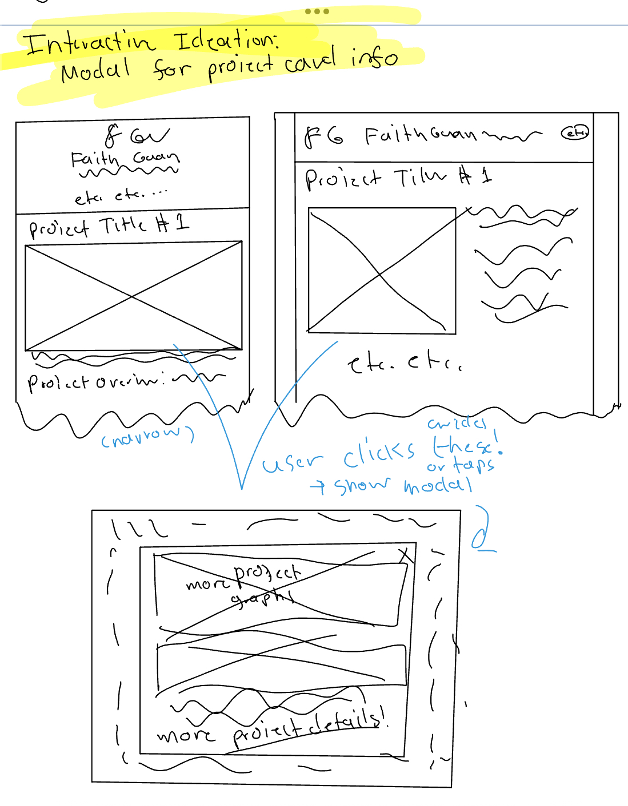
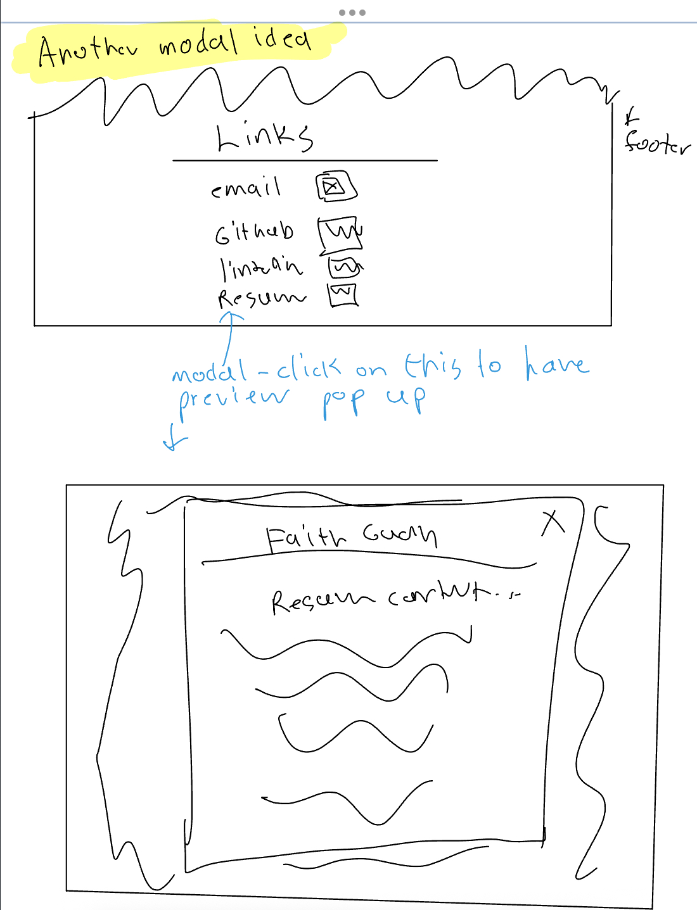
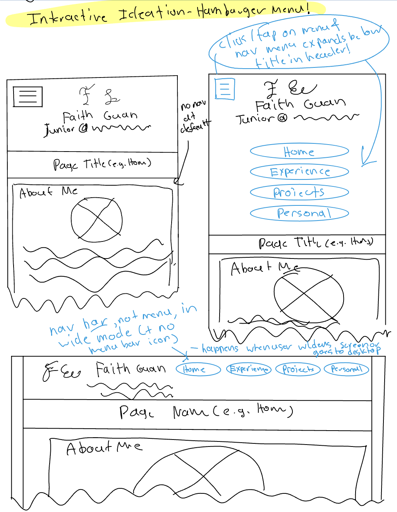
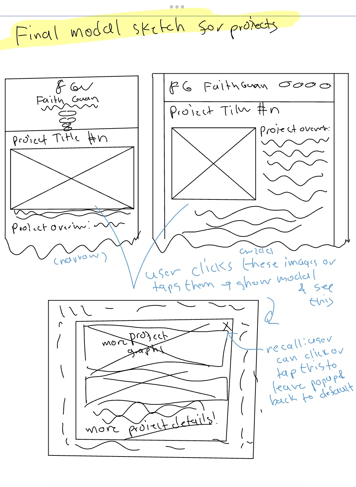
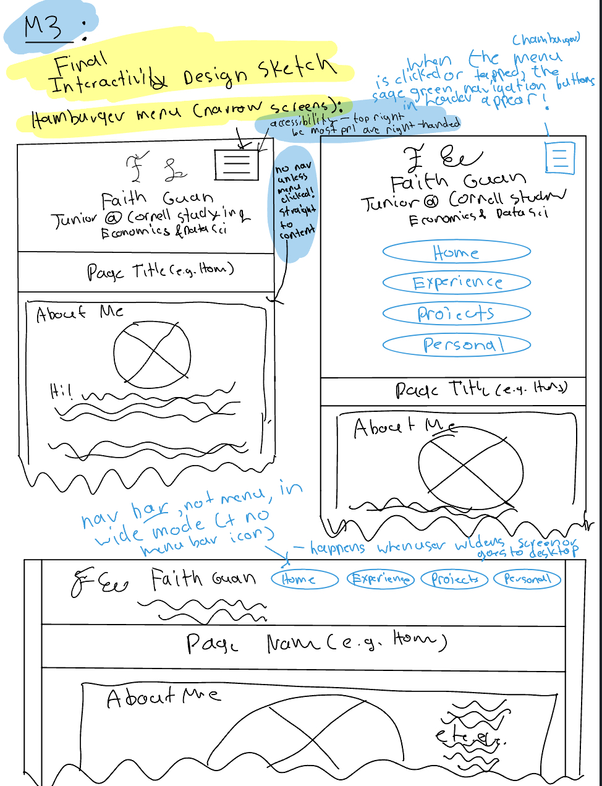
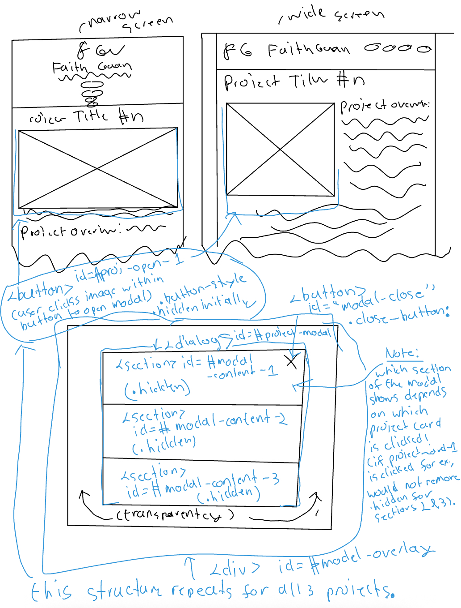
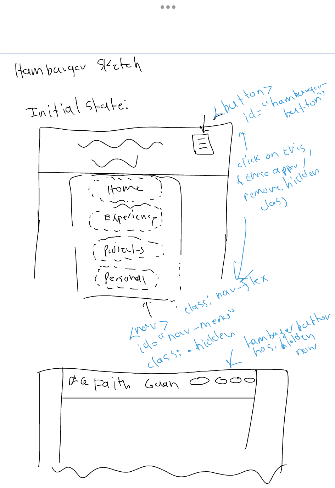

# Project, Milestone 3: Design Journal

[← Table of Contents](journal.md)


> **Replace ALL _TODOs_ with your work.** (There should be no TODOs in the final submission.)
>
> Be clear and concise in your writing. Bullets points are encouraged.
>
> Place all design journal images inside the "design-plan" folder and then link them in Markdown so that they are visible in Markdown Preview.
>
> **Everything, including images, must be visible in _Markdown: Open Preview_.** If it's not visible in the Markdown preview, then we can't grade it. We also can't give you partial credit either. **Please make sure your design journal is easy to read for the grader** (no side-ways images, etc.); in Markdown preview the **question _and_ answer should have a blank line between them**.


## Modal Interactivity Brainstorm
> Using the audience goals you identified, brainstorm possible options for **modal** interactivity to enhance the functionality of the site while also assisting the audience with their goals.
> Briefly explain each idea. (1 sentence)
> Note: You may find it easier to sketch for brainstorming. That's fine too. Do whatever you need to do to explore your ideas.

Modal idea #1: If you click on the project card, it expands into a larger view of the project screenshot with any additional screenshots for context + deeper explanations than are available in the figcaption right now.
Modal idea #2: On the home page, if you click on "Relevant Courses", it expands to show you more courses organized by category + some key things I learned or did that are applicable in each.
Modal idea #3: have a modal so when my resume is  clicked, it shows an accessible preview of the pdf, and inside could have a button if recruiters still want to see the resume in a new tab.


## Interactivity Design Ideation
> Explore the possible design solutions for the interactivity.
> Sketch (design sketch) at least one idea for the modal and at least one idea for the hamburger menu interactivity.
> Annotate each sketch explaining what happens when a user takes an action. (e.g. When user clicks this, something else appears.)
> Do not include HTML/CSS annotations in your sketches!

Iteration 1 of a modal project image popup design:


Iteration 1 of a modal resume preview popup design in footer:


Iteration 1 of hamburger menu design:



## Final Interactivity Design Sketches
> Create _polished_ design sketch(es) (it's still a sketch, but with a little more care taken to communicate ideas clearly to the graders) to plan your interactivity.
> Add annotations to explain what happens when the user takes an action.
> Include as many sketches as necessary to communicate your design (ask yourself, could another 1300 take these sketches an implement my design?)


**Modal design sketches:**

NOTE: I scrapped the resume modal preview feature upon further reflection obecause of how hard it is to view resumes on mobile devices and also because the point of the resume link in footer was to take people to it in another tab, making the modal here redundant and unnecessary.
Iteration 2 of a modal project image popup design:


**Hamburger drop-down navigation menu design sketches:**

Iteration 2 of hamburger menu design: note the change of menu bar from left to right for UX/accessibility reasons!



## Interactivity Rationale
> Describe the purpose of your proposed interactivity.
> Provide a brief rationale explaining how your proposed interactivity addresses the goals of your site's audience.
> This should be about a paragraph. (2-3 sentences)

My proposed interactivity through the hamburger menu meets the goals of my site's audience by making the website's content very findable and efficiently accessible, and one of the main goals of someone trying to screen a candidate is to do so effectively but very quickly. For the modal project pop up, this enables the viewer to quickly see a project overview by default, but if they are interested in more details and skills I used then they can click on the image to see more. This fits in with the goals because they can more thoroughly assess my skills by clicking to see more content for each project, but there isn't too much scrolling involved that wastes their time. In conclusion, these interactive designs save time and make things more accessible while allowing people to more effectively understand who I am and my capabilities.


## Interactivity Planning Sketches
> Produce planning sketches that include all the details another 1300 student would need to implement your interactivity design.
> Your planning sketches should include _all_ HTML elements needed for the interactivity; _annotations_ for the element types, their unique IDs, and CSS classes; and lastly the initial CSS classes.

**Modal planning sketches:**

Note: sketch is also meant to include a hover class on the image/card buttons that click to the modal so that users can see an effect indicating that the images can be clicked to go to more details. I just forgot to put it in the writing but it's meant to be there for the button.

**Hamburger drop-down navigation menu planning sketches:**




## Interactivity Pseudocode Plan
> Write your interactivity pseudocode plan here.
> Pseudocode is not JavaScript. Do not put JavaScript code here.

**Modal pseudocode:**

> Pseudocode to open the modal:

```
Note: the reason that I have only that line to open the modal is because I'd put all modal content into one and just choose when to show which based on which project card was picked, which is more similar to what the instructions requested than just having all 3 separate:

when #project-open-1 is clicked:
  remove .hidden from #modal-overlay
  remove .hidden from #modal-content-1
  add .hidden to #modal-content-2
  add .hidden to #modal-content-3

when #project-open-2 is clicked:
  remove .hidden from #modal-overlay
  remove .hidden from #modal-content-2
  add .hidden to #modal-content-1
  add .hidden to #modal-content-3

when #project-open-3 is clicked:
  remove .hidden from #modal-overlay
  remove .hidden from #modal-content-3
  add .hidden to #modal-content-1
  add .hidden to #modal-content-2
```

> Pseudocode to close the modal:

when #modal-close-button is clicked:
  add .hidden to #modal-overlay


Note: the following was talked through with the professor who helped approve the hamburger menu pseudocode
**Hamburger menu pseudocode:**

> Pseudocode to show/hide (toggle) the navigation menu (narrow screens) when the hamburger button is clicked:

```
when the hamburger button is clicked:
  if the navigation menu is not visible:
      remove .hidden from #nav-menu
  else:
      add .hidden from #nav-menu
```
 
> If the browser window is wide when the page loads, the hamburger button should not be visible.
> Showing and hiding the hamburger button should be accomplished using media queries.
>
> However, JavaScript should be used for the navigation menu's visibility.
> If the browser window is narrow when the page loads, the navigation should be hidden.
> Complete the pseudocode to show/hide (toggle) the navigation on page load:

```
on page load (ready):
  if window is narrow:
      add .hidden to #nav-menu
   else if window is wide:
      remove .hidden to #nav-menu
```

> If the browser window is resized from wide to narrow, the navigation should be hidden.
> If the browser window is resized from narrow to wide, the navigation should be visible.

```
on window resize:
  if window is narrow:
    add .hidden to #nav-menu
  else if window is wide:
    remove .hidden from #nav-menu
```


## References

### Collaborators
> List any persons you collaborated with on this project.

No collaborators.


### Reference Resources
> Did you use any resources not provided by this class to help you complete this assignment? (Do not list the course resources or the Mozilla documentation.)
> List any external resources you referenced in the creation of your project. (i.e. ChatGPT, etc.)
>
> Provide the URL to the resources you used and include a short description of how you used each resource.

N/A


[← Table of Contents](journal.md)
